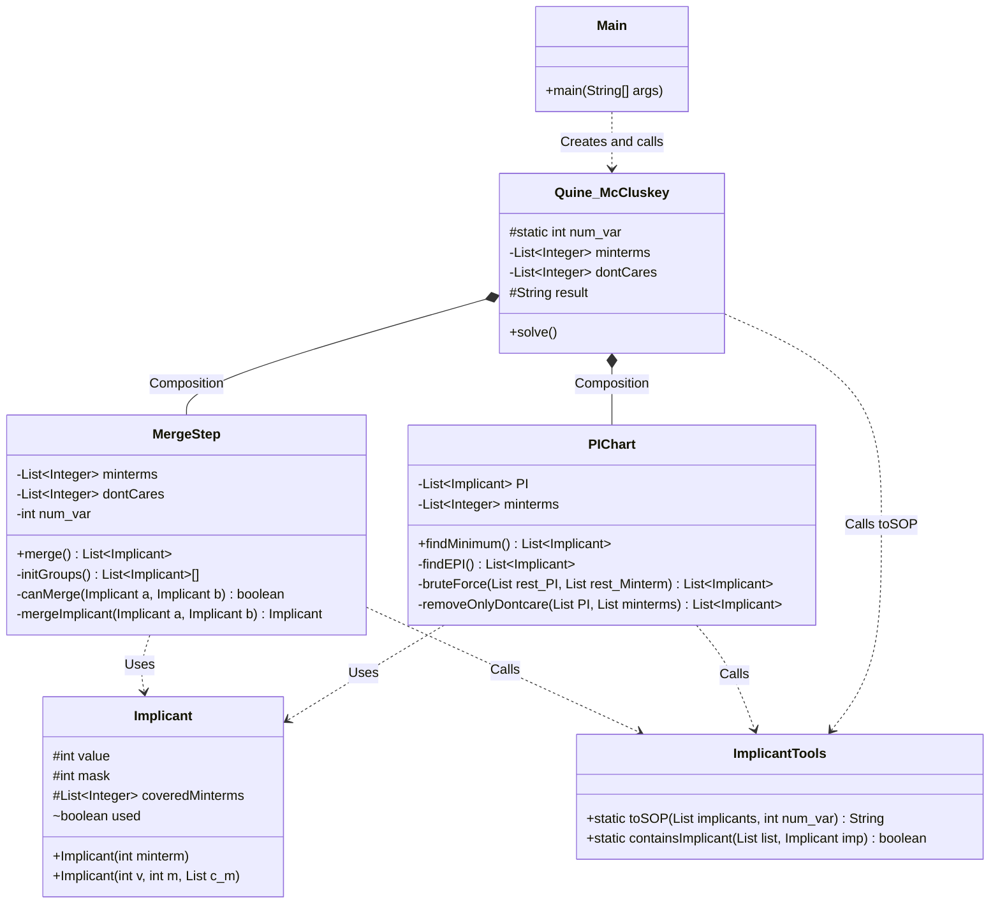

# Quine-McCluskey-Method-in-Java

# Members
- 22100368 서준예

# Project Description
This project implements Quine-McCluskey Method in Java, which is one of algorithms which minimize logic boolean functions. The program works for boolean logic function, which supports 2 to 5 variables and don't care terms. The program takes minterm numbers and don't care terms as input, and Output will be minimized boolean expression in SOP form.

User Guide

Step 1: Input number of variables  
Step 2: Input minterms one by one, enter -1 to finish  
Step 3: Input don't Care terms. You can enter -1 directly if none.  
Step 4: Result  
  

